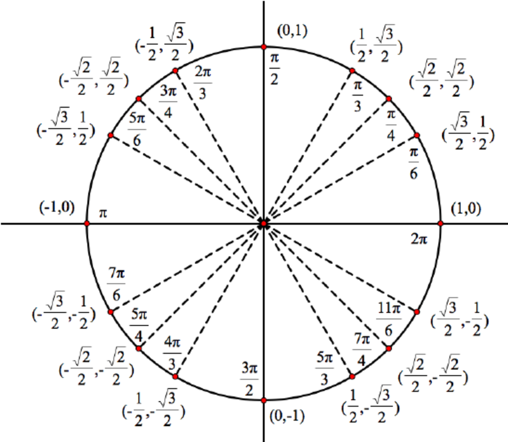
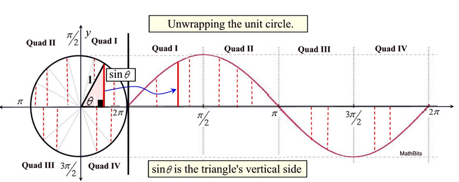

# ML Maths

## Vector maths

### Vectors and Scalars

1. Scalar: single number (e.g., temperature, weight)
2. Vector: list of numbers (has magnitude and direction)

$$
\mathbf{x} = [x_1, x_2, x_3]
$$

---

### Vector Operations (Addition, Dot Product, Norms)

Addition:
$$
\mathbf{a} + \mathbf{b} = [a_1 + b_1, a_2 + b_2]
$$

Dot Product (similarity):
$$
\mathbf{a} \cdot \mathbf{b} = \sum a_i b_i
$$

Norm (length of vector):
$$
||\mathbf{x}|| = \sqrt{\sum x_i^2}
$$

---

### Matrices and Matrix Operations

Matrix = collection of vectors

$$
A =
\begin{bmatrix}
a & b \\
c & d
\end{bmatrix}
$$

Matrix multiplication:
$$
AB \neq BA
$$

---

### Matrix Transformation (Geometric Interpretation)

Matrix = transformation of space

$$
\mathbf{y} = A\mathbf{x}
$$

Effect:
1. Rotation
2. Scaling
3. Shearing

---

### Linear Independence and Basis

1. Linearly independent: No vector can be written using others.
2. Basis: Minimum set of vectors to represent space

Example:
1. 2D space → need 2 independent vectors

---

### Rank of a Matrix

Rank = number of independent rows/columns

$$
\text{Rank}(A) = \text{number of independent vectors}
$$

Tells:
1. Information content
2. Redundancy in data

---

### Eigenvalues and Eigenvectors

A matrix transforms vectors

$$
A\mathbf{v} = \lambda \mathbf{v}
$$

1. Eigenvector = which vectors remain unchanged in direction after transformation (only scale). 
2. Eigenvalue = scaling factor for the eigen vectors

---

### Covariance Matrix

Shows how features vary together

$$
\text{Cov}(X, Y) = \frac{1}{n} \sum (x - \bar{x})(y - \bar{y})
$$

Matrix form:
$$
\Sigma = \text{covariance matrix}
$$

---

### Diagonalization and Spectral Decomposition

Matrix can be broken into:

$$
A = Q \Lambda Q^{-1}
$$

1. $Q$ = eigenvectors
2. $\Lambda$ = eigenvalues

Simplifies computation

---

## Sine and cosine

In math and (ML math) sin and cosine is in radians (in $\pi$ notation), not degrees. 

$$180^{\circ} = \pi \ \text{radians} \approx 3.1416$$
$$5 \ \text{radians} \approx 286.5^{\circ}$$

To convert from radians to degrees use this formula:-

$$\text{degrees} = \text{radians} \times \frac{180}{\pi}$$

So sin($5^{\circ}$) is not sin(5). same goes for cosine

     
    <em>unit circle for sin/cos understanding</em>

---

### sine

To calculate sin from radians use the formula

$$
sin(x) = \sum_{n=0}^{\infty} (-1)^n \frac{x^{2n+1}}{(2n+1)!}
$$

Which is the taylor series definition of sine. It is essential that x is in radians.

$$sin(\pi/6) → \text{converges to} \ \frac{1}{2}$$
$$sin(5) → \text{converges to} \ -0.9589$$
$$sin(1) → \text{converges to} \ 0.84$$

Sine comes from the unit circle

1. Take a circle of radius 1
2. Start at angle 0
3. Rotate counter clockwise by angle $\theta$
4. sin($\theta$) = y-coordinate of the point
5. so sin($\theta$) = vertical height of the point on the circle

So eg:- If we start at angle $\theta$ and rotate counter-clockwise till $\pi/6$ we get sin($\pi/6$) = 1/2. Which is the y-coordinate of the point on the unit circle. 

There is one more thing about sine which is it's wave representation. As we already know that sin is the y-coordinate of a unit circle that how can it be represented in a wave. Once you unwrap the circle in a linear fashion it creates a wave shape and since sine is periodic the wave becomes periodic too.

     
    <em>unwrapping the sin for wave representation</em>

---

### cosine

To calculate cos from radians use the formula

$$
\cos(x) = \sum_{n=0}^{\infty} (-1)^n \frac{x^{2n}}{(2n)!}
$$

Which is the Taylor series definition of cosine. It is essential that $x$ is in radians.

$$\cos(\pi/6) \rightarrow \text{converges to} \ \frac{\sqrt{3}}{2}$$
$$\cos(5) \rightarrow \text{converges to} \ 0.2837$$
$$\cos(1) \rightarrow \text{converges to} \ 0.5403$$

Cosine comes from the unit circle

1. Take a circle of radius 1
2. Start at angle 0
3. Rotate counter clockwise by angle $\theta$
4. cos($\theta$) = x-coordinate of the point
5. so cos($\theta$) = horizontal distance of the point from the origin

So eg:- If we start at angle $\theta$ and rotate counter-clockwise till $\pi/6$ we get cos($\pi/6$) = $\sqrt{3}/2$. Which is the x-coordinate of the point on the unit circle. 

