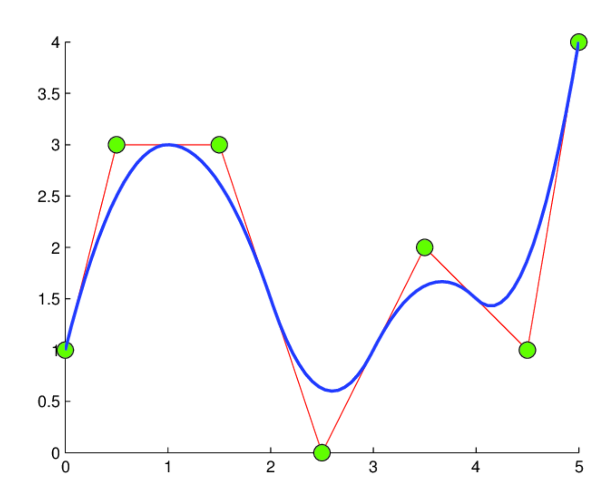

# Kolmogorov-Arnold Networks (KANs)

KAN models are more research oriented and are less likely to be used in actual world problem solving. A KAN layer replaces the usual weighted sum $+$ activation with learnable functions on each input connection, then adds those functions together.  A normal neural network does

$$
y = (\sigma (\sum_{i}w_i x_i + b))
$$

On the other hand KAN does

$$ 
y =  \sum_{i}\phi(x_i)
$$

Here there are no scaler weights, no global activation, but each connection has its own learnable function $\phi(\cdot)$, outputs are simply summed. Now there are many types of KAN models including Spline based, RBF kernel based, etc. We first explain simple Spline based KAN model with an example

## Spline based KAN model

assume we have a simple spline based KAN model. 

$$
y = \phi(x)
$$
$$
\text{Here} \ \phi \rightarrow  \text{Spline}
$$

     
    <em>Spline KAN</em>

Spline is just a simple curve made by stitching together multiple simple curves. So that the entire thing resemble a smooth function. In ML we use cubic splines 

$$
p_i = a_ix^3 = b_ix^2 + c_ix + d_i
$$

Cubic behavior ensures linearity (not flexible), quadratic (poor curvature control) and cubic leading to smooth and stable curves. Here is an example of how splines work in simple forward and backward propagation. Assume a simple tiny KAN model 

$$ 
y = \phi(x)
$$

I/P range : x $\in$ [0, 1]

3 knots : $t_0 = 0$, $t_1 = 0.5$ and $t_2 = 1$

So we will have two spline segments 

1. Segment 0: [0, 0.5]
2. Segment 1: [0.5, 1]

$$
\phi(x) = v_k + s_k (x - t_k)
$$

Each segment is a line. So here we  have two s as parameters stored by the model $s_0$ and $s_1$. And two values at knots as $v_0$ and $v_1$. $v_1$ is derived from segment 0 to ensure connectivity. x is the input so t becomes the height or y co-ordinate of the curve at x.

This gets us two line equations

$$
\phi(x) = v_0 + s_0 (x - t_0)
$$
$$
\phi(x) = v_1 + s_1 (x - t_1)
$$

1. **Forward propagation**

    assume $v_0 = 0$ and $v_1 = 0$ are the values at knots initially. And $s_0 = 0.01$ and $s_1 = -0.02$ are the parameters initialized by model at the start. 

    Now let I/P be 0.6. Find which segment x belongs to 0.6 $\in$ [0.5, 1] $\rightarrow$ Segment 1 
    So now we use 
    $$
    \phi(x) = v_1 + s_1(x - t_1)
    $$

    Compute output: 
    $$
    v_1 = 0
    $$
    $$ 
    s_1 = -0.02
    $$ 
    $$
    t_1 = 0.5
    $$ 
    $$
    y = 0 + (-0.02)(0.6 - 0.5) = -0.02 \times 0.1 = -0.002
    $$  
    Forward pass done   

    Loss computation 
    $$
    y_{true} = 1.0
    $$
    $$
    \mathcal{L} = (y - y_{true})^2 = (-0.002 - 1)^2 = 1.004
    $$

2. **Backward propagation**

    How should $v_1$ and $s_1$ change to reduce the error. 
    Gradient loss w.r.t output 
    $$
    \frac{d\mathcal{L}}{dy} = 2(y - y_{true}) = 2(-1.002) = -2.004
    $$
    Gradient w.r.t spline parameters
    $$
    y = v_1 + s_1(x - t_1)
    $$
    $$
    \frac{dy}{dv_1} = 1
    $$
    $$
    So, \ \frac{dy}{dv_1} = -2.004
    $$
    gradient w.r.t $s_1$
    $$
    \frac{dy}{ds_1} = (x - t_1) = 0.1
    $$
    $$
    So, \ \frac{dy}{ds_1} = -2.004 \times 0.1 = -0.2004
    $$

    To get gradient w.r.t. we do this.
    $$ 
    \text{Note} \ \frac{dy}{ds_1} = 0.1 So now \frac{d\mathcal{L}}{ds_1} = \frac{d\mathcal{L}}{dy} \cdot \frac{dy}{ds_1} = -0.200 \times 0.1
    $$

3. **parameter update**

    assuming lr = 0.1

    $$
    v_1 = v_1 - lr \times \frac{d\mathcal{L}}{dv_1} = 0 - 0.1 \times (-2.004) = 0.2004
    $$

    $$
    s_1 = s_1 - lr \times \frac{d\mathcal{L}}{ds_1} = 0.02 - 0.1 \times (-0.2004) = 0.00004
    $$

4. Next iteration

    at x = 0.6
    $$
    y = 0.2004 + 0.00004 (0.6 - 0.5) \approx0.2004
    $$ 

**Note that**

1. Range for segments are pre-decided. e.g. [0, 1] are fixed and not learned 
2. To ensure inputs remain within the range [0, 1] we have 3 methods 
    1. Input normalization 
    $$
    x_{norm} = \frac{x - min}{max - min}
    $$
    2. Clipping 
    $$
    x = clamp(x, 0, 1)
    $$
    3. learnable rescaling 
    $$
    x' = ax + b
    $$

---

## RBF Kernel based KAN model

$$
y_0 = \sum_{i, r} W_{o. i. r} exp(\frac{-(x_i - C_{i, r}^2}{2.\sigma_{i, r}^{2}})
$$

RBF kernel has no knots or segments. Instead it is formed by multiple guassian curves which are overlapping and has smooth bumps.

$$
exp(\frac{-(x - x)^2}{2.\sigma^2})
$$

Unlike real KAN with splines, RBF KAN or FastKAN uses gaussian (multiple gaussian) to mimic any smooth function. For any curve that you want to mimic you can stack multiple gaussian bumps shifted to different centers, streched, skewed, scaled, etc and add them up together. This will mimic almost any type of curve be it sin, cos, polynomial, exponential, square root, log, absolute, etc....

---

### Gaussian

1. These are smooth bell shaped curves 
    $$
    g(x) = e^{-x^2}
    $$
    at x = 0 and g = 1 
    as x grows, value slowly moves to 0
2. Shift the bell 
    If instead of closeness to value 0 you need closeness to some value c, then we can shift the gaussian curve using 
    $$
    g(x) = e^{-(x - c)^2}
    $$
    So here x=c, value is higher near c 
    And this value decays as we move away 
    c $\rightarrow$ center
3. One gaussian is not enough 
    So we use multiple gaussian with different centers
    $$
    \phi_1(x), \phi_2(x), , \phi_3(x), , ..., \phi_n(x)
    $$
    Each one say's how much is 'x' near my center.
4. Combining them (function approximation) 
    $$
    f(x) = \sum_{r=1}^{k}w_r \text{exp}(-\frac{(x - c_r)^2}{2\sigma_r^2})
    $$
    Here $\sigma$ is the width knob 
    This is the Radial Bias Function (RBF)
    You can approximate any smooth function using gaussian.

So forward function for an RBF kernel works like

1. Compute distance to all centers.
2. Evaluate all gaussian.
3. Linearly combine all of them.
$$
\phi(x) = \sum_{r}w_r \text{exp}(-\frac{(x - c_r)^2}{2\sigma_r^2})
$$
4. So in FASTKAN or RBF KAN the learnable parameters are $\sigma_r$ and $w_r$ are learnable parameters.

Rest of the backward pass and parameter update remains same.

---

