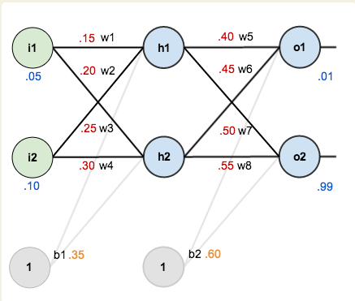
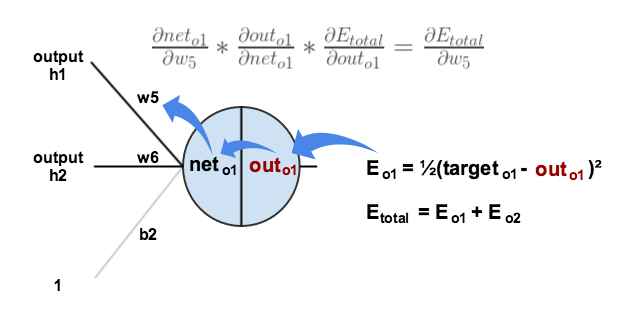

# Model training techniques

## Understanding forward and backward propagation in NN

### Forward Pass

     
    <em>Simple Neural Network</em>

To begin, let us see what the neural network currently predicts given the weights, biases, and inputs of $0.05$ and $0.10$. We feed these inputs forward through the network. We compute the total net input to each hidden neuron, apply the activation function (logistic function), and repeat the process for the output layer.

---

### Hidden Layer

$$
net_{h1} = w_1 i_1 + w_2 i_2 + b_1
$$

$$
net_{h1} = 0.15 \cdot 0.05 + 0.2 \cdot 0.1 + 0.35 = 0.3775
$$

$$
out_{h1} = \frac{1}{1 + e^{-net_{h1}}} = \frac{1}{1 + e^{-0.3775}} = 0.593269992
$$

Similarly,

$$
out_{h2} = 0.596884378
$$

---

### Output Layer

$$
net_{o1} = w_5 \cdot out_{h1} + w_6 \cdot out_{h2} + b_2
$$

$$
net_{o1} = 0.4 \cdot 0.593269992 + 0.45 \cdot 0.596884378 + 0.6 = 1.105905967
$$

$$
out_{o1} = \frac{1}{1 + e^{-net_{o1}}} = \frac{1}{1 + e^{-1.105905967}} = 0.75136507
$$

Similarly,

$$
out_{o2} = 0.772928465
$$

---

### Total Error}

$$
E_{total} = \sum \frac{1}{2}(target - output)^2
$$

For $o_1$:

$$
E_{o1} = \frac{1}{2}(0.01 - 0.75136507)^2 = 0.274811083
$$

For $o_2$:

$$
E_{o2} = 0.023560026
$$

$$
E_{total} = E_{o1} + E_{o2} = 0.298371109
$$

---

### Backward Pass

     
    <em>Simple Neural Network</em>
</p

Our goal is to compute gradients to update weights using backpropagation. So naturally by chain rule

**Gradient for $w_5$**

$$
\frac{\partial E_{total}}{\partial w_5}
= \frac{\partial E_{total}}{\partial out_{o1}}
\cdot
\frac{\partial out_{o1}}{\partial net_{o1}}
\cdot
\frac{\partial net_{o1}}{\partial w_5}
$$

**Step 1:**

$$
\frac{\partial E_{total}}{\partial out_{o1}}
= -(target_{o1} - out_{o1})
= -(0.01 - 0.75136507)
= 0.74136507
$$

**Step 2:**

$$
\frac{\partial out_{o1}}{\partial net_{o1}}
= out_{o1}(1 - out_{o1})
= 0.75136507(1 - 0.75136507)
= 0.186815602
$$

**Step 3:**

$$
\frac{\partial net_{o1}}{\partial w_5}
= out_{h1} = 0.593269992
$$

**Final Gradient**

$$
\frac{\partial E_{total}}{\partial w_5}
= 0.74136507 \cdot 0.186815602 \cdot 0.593269992
= 0.082167041
$$

---

## Learning rate

## Learning rate schedules

A decaying learning rate scheduler gradually reduces the learning rate (LR) as training progresses. The idea is simple: Take big steps early to learn fast, then smaller steps later to fine-tune.

Best decaying strategies:-

1. **Step decay** 

    Reduce learning rate by a fixed factor every N epochs 
    $$
    lr = lr_0 × \gamma^{(epoch / step\_size)}
    $$ 
    Here $lr_0$ = 0.1 and $\gamma$ = 0.1 So every 10 epochs lr reduces by 10 times 

2. **Exponential Decay**

    LR decays smoothly every step. k $\rightarrow$ decay rate and t $\rightarrow$  current epoch 
    $$
    lr = lr_0 \times exp(-k × t)
    $$
    Fast decay early, slower later. Very smooth, no sudden jumps.

3. Linear Decay 

    LR decreases linearly to zero (or min\_lr). Here t \rightarrow current epoch and T $\rightarrow$ total epochs.
    $$
    lr = lr_0 \times (1 − t / T)
    $$
    Simple, predictable, popular in transformers.

4. Cosine Decay 

    LR follows a cosine curve. Here t $\rightarrow$ current epoch and T $\rightarrow$ total epochs.
    $$
    lr = lr_{min} + 0.5 × (lr_0 − lr_{min}) × (1 + cos(\pi t / T))
    $$
    Large LR at start. Very small LR at end. Smooth and stable.

---

## Singular Value Decomposition (SVD)

Singular Value Decomposition (SVD) is a method to decompose any matrix into three simpler matrices. It helps us understand the structure of data and perform dimensionality reduction.

**Mathematical Form**

For any matrix $A \in \mathbb{R}^{m \times n}$:

$$
A = U \Sigma V^T
$$

where:

1. $U$ = matrix of left singular vectors ($m \times m$)
2. $\Sigma$ = diagonal matrix of singular values ($m \times n$)
3. $V$ = matrix of right singular vectors ($n \times n$)

**Key Properties**

1. $U^T U = I$ and $V^T V = I$ (orthogonal matrices)
2. Singular values $\sigma_1 \ge \sigma_2 \ge \cdots \ge 0$

**How it Works (Intuition)**

SVD breaks a matrix transformation into three steps:

1. $V^T$: rotates the input space
2. $\Sigma$: scales (stretches/shrinks)
3. $U$: rotates again to final space

**Connection to Eigenvalues**

1. Columns of $V$ = eigenvectors of $A^T A$
2. Columns of $U$ = eigenvectors of $A A^T$
3. Singular values:
$$
\sigma_i = \sqrt{\lambda_i}
$$

**Low-Rank Approximation**

We can keep only top $k$ singular values:

$$
A_k = U_k \Sigma_k V_k^T
$$

1. Reduces dimensions
2. Keeps most important information

---

## Alternating Least Squares (ALS)

Alternating Least Squares (ALS) is a powerful optimization algorithm primarily used for Matrix Factorization in recommendation systems like Netflix and Amazon. It decomposes a large, sparse rating matrix $R$ into two lower-rank, dense matrices: $U$ (User features) and $V$ (Item features), such that $R \approx U V^T$.

**The Objective Function**

The goal of ALS is to minimize the reconstruction error between observed ratings and the dot product of latent vectors, while preventing overfitting through $L_2$ regularization. The total loss function $J$ is defined as:

$$
J(U, V) = \sum_{(u,i) \in \text{Observed}} (r_{ui} - \mathbf{u}_u^T \mathbf{v}_i)^2 + \lambda \left( \sum_{u} \|\mathbf{u}_u\|^2 + \sum_{i} \|\mathbf{v}_i\|^2 \right)
$$

Where:

1. $r_{ui}$ is the actual rating given by user $u$ to item $i$.
2. $\mathbf{u}_u^T \mathbf{v}_i$ is the predicted rating (dot product of latent vectors).
3. $\lambda$ is the regularization parameter (penalty for large vector magnitudes).
4. $\|\mathbf{u}_u\|^2$ and $\|\mathbf{v}_i\|^2$ are the squared $L_2$ norms of the feature vectors.

**The Alternating Optimization Logic**

The joint optimization of $U$ and $V$ is a non-convex problem due to the bilinear interaction ($\mathbf{u}_u \times \mathbf{v}_i$), which creates a saddle-shaped loss surface. ALS handles this by breaking the problem into two convex sub-problems:

1. **Fix $V$, Solve for $U$:** 
    By treating the item vectors as constants, the objective function becomes quadratic (convex) with respect to $U$. 

    The objective function for a single user $u$ is a regularized least squares problem:
    $$
    \arg \min_{\mathbf{u}_u} \sum_{i \in I_u} (r_{ui} - \mathbf{u}_u^T \mathbf{v}_i)^2 + \lambda \|\mathbf{u}_u\|^2
    $$
    By setting the gradient to zero, we obtain the analytical solution for matrix format:
    $$
    \mathbf{u}_u = (V_u^T V_u + \lambda I)^{-1} V_u^T R_u
    $$

2. **Fix $U$, Solve for $V$:** 

    We then treat the newly calculated user vectors as constants and solve for each item vector $\mathbf{v}_i$:

    The objective function for a single item $i$ is a regularized least squares problem:
    $$
    \arg \min_{\mathbf{v}_i} \sum_{u \in U_i} (r_{ui} - \mathbf{u}_u^T \mathbf{v}_i)^2 + \lambda \|\mathbf{v}_i\|^2
    $$

    By setting the gradient to zero, we obtain the analytical solution for matrix format:
    $$
    \mathbf{v}_i = (U_i^T U_i + \lambda I)^{-1} U_i^T R_i
    $$

3. This process repeats iteratively until the total loss converges. Because each step is independent for every user/item, ALS is highly parallelizable across distributed clusters.

**Latent Factors and Inference**

The algorithm essentially "manipulates" the numbers inside the vectors to discover hidden (latent) patterns.

1. **User Vectors ($\mathbf{u}_u$):** Represent the user's affinity toward specific latent themes (e.g., genre, pace, or price point).
2. **Item Vectors ($\mathbf{v}_i$):** Represent the item's profile in those same latent dimensions.

For a new user, we perform a process called (Folding In), Instead of retraining the whole model, we keep the global Item Matrix $V$ fixed and solve the single-user optimization equation using their initial interactions to generate a new user vector $\mathbf{u}_{new}$.

**Ranking and Recommendation**

Once the vectors are learned, item ranking is achieved by calculating the predicted score for all items:
$$
\text{Scores} = \mathbf{u}_{new} \times V^T
$$
The items are then sorted by score in descending order. In large-scale systems, spatial data structures like KD-Trees or Ball Trees are used to perform this search efficiently by pruning distant sections of the vector space.

---

## Gradient Descent

Gradient Descent is an optimization algorithm used to minimize a function (usually loss) by iteratively moving in the direction of steepest descent.

**Core Idea**

Move parameters in the opposite direction of the gradient:

$$
\theta = \theta - \eta \nabla J(\theta)
$$

1. $\theta$ = parameters
2. $\eta$ = learning rate (step size)
3. $\nabla J(\theta)$ = gradient (slope of loss)

**Intuition**

1. Gradient points to steepest increase
2. Move opposite → decrease loss

**Example (1D Case)**

$$
\theta = \theta - \eta \frac{dJ}{d\theta}
$$

**For Linear Regression**

Loss (MSE):

$$
J(\theta) = \frac{1}{n} \sum (y_i - \hat{y}_i)^2
$$

Update rule:

$$
\theta_j = \theta_j - \eta \frac{\partial J}{\partial \theta_j}
$$

---

### Types of Gradient Descent

1. **Batch Gradient Descent**

    1. Uses entire dataset
    2. Stable but slow

2. **Stochastic Gradient Descent (SGD)**

    1. Uses one sample at a time
    2. Fast but noisy

1. **Mini-batch Gradient Descent**

    1. Uses small batches
    2. Balance of speed and stability

**Learning Rate ($\eta$)**

1. Too large → may overshoot minimum
2. Too small → slow convergence

**Convergence**

Stop when:

1. Gradient is close to zero
2. Loss stops decreasing

---

## Hyper parameter tuning

## Normalization

### Layer Normalization (LayerNorm)

Layer Normalization is a technique used to stabilize the hidden states in deep neural networks, particularly in Recurrent Neural Networks (RNNs) and Transformers. Unlike Batch Normalization, which normalizes across the batch dimension, LayerNorm computes the mean and variance for each individual training sample across all its features. For an input vector $x$ with $d$ dimensions:

$$
\mu = \frac{1}{d} \sum_{i=1}^{d} x_i
$$
$$
\sigma^2 = \frac{1}{d} \sum_{i=1}^{d} (x_i - \mu)^2
$$
$$
y_i = \frac{x_i - \mu}{\sqrt{\sigma^2 + \epsilon}} \cdot \gamma_i + \beta_i
$$

The numerator re-centers the features to a zero mean, while the denominator scales them to unit variance. The learnable parameters $\gamma$ (gain) and $\beta$ (bias) allow the model to 're-scale and shift' the normalized values if necessary for optimal learning.  For testing, LayerNorm behaves the same as training and computes $\mu$ and $\sigma^2$ from each input sample.

---

### Root Mean Square Normalization (RMSNorm)

RMSNorm is a simplified version of LayerNorm that removes the re-centering (mean subtraction) requirement. It is based on the hypothesis that the re-scaling invariance provided by the denominator is the primary driver of training stability, rather than the mean-shifting. 

For an input vector $x$ with $d$ dimensions:

$$
\text{RMS}(x) = \sqrt{\frac{1}{d} \sum_{i=1}^{d} x_i^2 + \epsilon}
$$
$$
y_i = \frac{x_i}{\text{RMS}(x)} \cdot \gamma_i
$$

This method **only rescales** but does not shift. By calculating the Root Mean Square instead of the standard deviation, RMSNorm reduces computational overhead by approximately 10\% to 40\%. It is the standard normalization method used in modern architectures like Llama 3 to maintain numerical stability in very deep models while improving throughput.

**For testing, RMSNorm behaves the same as training and computes normalization (RMS / $\sigma^2$) from each input sample.**

---

### BatchNorm (Batch Normalization)

Batch Normalization is a technique designed to accelerate training by reducing Internal Covariate Shift—the change in the distribution of network activations due to updates in the preceding layers. Unlike LayerNorm, which normalizes across features, BatchNorm computes statistics across the **entire mini-batch** for each feature independently.

For a mini-batch $B = \{x_1, \dots, x_m\}$ of size $m$:

1. Mini-batch Mean: 
    $$\mu_B = \frac{1}{m} \sum_{i=1}^{m} x_i
    $$
2. Mini-batch Variance:
    $$
    \sigma_B^2 = \frac{1}{m} \sum_{i=1}^{m} (x_i - \mu_B)^2
    $$
3. Normalized Output:
    $$
    \hat{x}_i = \frac{x_i - \mu_B}{\sqrt{\sigma_B^2 + \epsilon}}
    $$
4. Scale and Shift:
    $$
    y_i = \gamma \hat{x}_i + \beta
    $$

The numerator re-centers the batch to a zero mean, and the denominator scales it to unit variance. The learnable parameters $\gamma$ and $\beta$ allow the network to undo the normalization if the identity transform is more optimal for the loss function. So it rescales and shits for batch size. Use batchnorm for deep NN, CNNs or unstable training loss issues. Dont use it for sequential models or small batch size.

**For testing, BatchNorm uses stored running mean and variance (during training) instead of computing them from the current batch to ensure stable and consistent predictions.**

---

## Dropout

Consider a single layer output:
$$h = [0.3,\, 0.6,\, 0.77,\, 0.55]$$

Let the keep probability be:
$$p = 0.5$$

**Forward Pass**

We sample a mask $M$ from a Bernoulli distribution with shape same as the single layer:

$$
M \sim \text{Bernoulli}(p), \quad M = [1,\, 0,\, 1,\, 0]
$$

Using inverted dropout:
$$
\tilde{h} = \frac{M \odot h}{p}
$$

$$
\tilde{h} =\frac{
[1 \cdot 0.3,\, 0 \cdot 0.6,\, 1 \cdot 0.77,\, 0 \cdot 0.55]
}{0.5} = [0.6,\, 0,\, 1.54,\, 0]
$$

Thus, half the neurons are dropped (set to zero), and the remaining activations are **scaled** by:
$$
\frac{1}{p} = 2
$$

**Backward Pass**

Let the upstream gradient be:
$$
[g_1,\, g_2,\, g_3,\, g_4]
$$

The gradient after applying dropout becomes:
$$
\frac{M \odot [g_1,\, g_2,\, g_3,\, g_4]}{p} = [2g_1,\, 0,\, 2g_3,\, 0]
$$

**Inference Time**

At inference time, dropout is not applied. We directly use the original activations:
$$
h = [0.3,\, 0.6,\, 0.77,\, 0.55]
$$

No masking or scaling is performed.

---

## Optimizers

An optimizer is an algorithm that updates the parameters (weights and biases) of a neural network to minimize the loss function.

There are two types of optimizers:

1. **First-order optimization algorithms** (use only first-order derivatives), e.g., SGD, RMSProp
2. **Second-order optimization algorithms** (use second-order derivatives), e.g., Newton’s Method, L-BFGS

**Types of First-order Optimizers**

1. **Stochastic Gradient Descent (SGD):** 

    Updates parameters using the gradient of the loss.
    $$
    \theta = \theta - \eta \nabla L(\theta)
    $$

2. **Momentum:** 
    Helps accelerate SGD by adding a moving average of past gradients. $\beta v_{t-1}$ is the look back here.
    $$
    v_t = \beta v_{t-1} + (1 - \beta)\nabla L(\theta)
    $$
    $$
    \theta = \theta - \eta v_t
    $$

3. **Nesterov Accelerated Gradient (NAG):** 

    A modification of momentum that looks ahead before computing the gradient. $\theta - \eta \beta v_{t-1}$ is the look ahead part.
    $$
    v_t = \beta v_{t-1} + \nabla L(\theta - \eta \beta v_{t-1})
    $$
    $$
    \theta = \theta - \eta v_t
    $$

4. **Adagrad (Adaptive Gradient Algorithm):** 

    Adapts learning rate for each parameter based on past gradients. It takes the squared sum of gradients (magnitude) not the average (direction) of past gradients making adagrad more adaptive.
    $$
    G_t = G_{t-1} + \nabla L(\theta)^2
    $$
    $$
    \theta = \theta - \frac{\eta}{\sqrt{G_t + \epsilon}} \cdot \nabla L(\theta)
    $$

5. **RMSProp (Root Mean Square Propagation):** 

    Adapts the learning rate using an exponentially decaying average of squared gradients, preventing the learning rate from shrinking too aggressively (unlike Adagrad).
    $$
    v_t = \beta v_{t-1} + (1 - \beta)\nabla L(\theta)^2
    $$
    $$
    \theta = \theta - \eta \cdot \frac{\nabla L(\theta)}{\sqrt{v_t} + \epsilon}
    $$
6. **Adam (Adaptive Moment Estimation):** 

    Combines Momentum and RMSProp using moving averages of gradients and squared gradients.
    $$
    m_t = \beta_1 m_{t-1} + (1 - \beta_1)\nabla L(\theta)
    $$
    $$
    v_t = \beta_2 v_{t-1} + (1 - \beta_2)\nabla L(\theta)^2
    $$
    $$
    \theta = \theta - \eta \cdot \frac{m_t}{\sqrt{v_t} + \epsilon}
    $$

---

## Regularization

It solves the problem of overfitting, reduces model complexity and improves generalization. 

---

### L1 regularization (Lasso)

Penalty Term: The sum of the absolute values of the weights 

$$
L1 = \lambda \sum |w_i|
$$

Adds the sum of the absolute values of weights to the loss function. Encourages some weights to become exactly zero, effectively selecting only the most important features. Useful for sparse models and feature selection. The gradient of ∣w∣ is either +1 or -1, creating a strong "pull" towards zero.

---

### L2 regularization (Ridge)

$$
L2 = \lambda \sum (w_i)^2
$$

Adds the sum of the squared values of weights to the loss function. Shrinks weights towards zero but doesn’t make them exactly zero. Helps prevent overfitting while keeping all features. The gradient of $w^2$ is continuous and smooth (always 2w), so the model gradually decreases weights instead of forcing them to zero.

---

## Imbalanced Learning

1. oversampling

2. Undersampling

3. semi-supervised learning

4. using class weight

5. imblearn-libraru  SPE undersampling method

---

## Transfer learning

## Incremental learning

## Gradient Clipping

In deep learning, gradients are computed using repeated chain multiplications (chain rule):

$$
\frac{\partial L}{\partial \theta} = \frac{\partial L}{\partial h_T} \times \prod_{t=1}^{T} \frac{\partial h_t}{\partial h_{t-1}}
$$

Here, $h_T$ is the final hidden state, $L$ is the loss, and $\prod \left( \frac{\partial h_t}{\partial h_{t-1}} \right)$ represents gradient propagation through chained hidden states.

**If these derivatives are**:

1. $> 1$ $\rightarrow$ gradients grow exponentially (exploding gradients)
2. $< 1$ $\rightarrow$ gradients shrink exponentially (vanishing gradients)

**Understanding with an example in deep networks:**

$$
\frac{\partial L}{\partial w}
=
\frac{\partial L}{\partial h_3}
\times
\frac{\partial h_3}{\partial h_2}
\times
\frac{\partial h_2}{\partial h_1}
\times \cdots
$$

**The middle terms**:

$$
\frac{\partial h_i}{\partial h_{i-1}}
$$

**are multiplied many times**.

1. If each $dh_i/dh_{i-1}$ term $> 1$:
$$
2 \times 2 \times 2 \times \cdots = 2^L \rightarrow \text{explodes}
$$

2. If each $dh_i/dh_{i-1}$ term $< 1$:
$$
0.5 \times 0.5 \times 0.5 \times \cdots = 0.5^L \rightarrow \text{vanishes}
$$

3. If each term $dh_i/dh_{i-1}$ $\approx 1$:
$$
1 \times 1 \times 1 \times \cdots = 1^L = 1 \rightarrow \text{stable}
$$

So derivatives should be close to 1 (for intermediate jacobians not derivatives of individual weights). Exploding gradients cause huge weight updates, loss becoming $\text{NaN}$ or $\infty$, model divergence, and unstable training. Hence, gradient clipping acts as a safety mechanism. Remember gradient clipping is only for exploding gradients and not vanishing gradients.

**Types of Gradient Clipping:**

1. **(A) Clip by Value**

    $$
    g = \text{clip}(g, -c, c)
    $$
    Restricts each gradient value within a fixed range. c = 1.0 normally.

2. **(B) Clip by Norm (more common)**

    $$
    g = g \cdot \frac{c}{\|g\|}
    $$
    If $\|g\| > c$, scale it down. c = 1.0 normally. 
    This preserves direction while reducing magnitude.

---

## Memory optimization

1. Gradient accumulation
2. Freezing
3. Automatic mixed precision
4. 8-bit optimizers
5. Gradient check-pointing
6. Fast tokenizer
7. Dynamic padding
8. Uniform dynamic padding

---

## Neural Network weight initialization

### Greedy Layer-wise Unsupervised Pretraining (GLUP)

To explain Greedy Layer-wise Unsupervised Pretraining (GLUP) simply, think of it as building a skyscraper one floor at a time, ensuring each floor is stable before adding the next, rather than trying to build the entire skeleton at once.

Here is the step-by-step workflow:

1. **Train the First Layer (Unsupervised):**

    You take your raw input data and train only the first hidden layer (usually as a Restricted Boltzmann Machine (RBM) or an Autoencoder). The goal here is simple: "Learn to reconstruct the input." No labels are used; the model just learns the basic features (like edges in an image).

2. **Freeze and Pass Up:**

    Once the first layer is trained, you freeze its weights. You then pass the data through this layer to get a new "representation" (the activations). These activations now act as the "raw input" for the second layer.
    
3. **Repeat for Subsequent Layers (The "Greedy" Part):**

    You add a second layer and train it to reconstruct the output of the first layer. You continue this process—layer by layer—until the network is as deep as you want. It is called Greedy because you are optimizing each layer locally without looking at the "big picture" yet.

4. **Fine-Tuning (The Supervised Final Step):**

    Now that you have a stack of pretrained layers with "smart" initial weights, you add a final output layer (like a Softmax layer for classification). You then train the entire network together using labeled data and standard backpropagation.

---

### Glorot (Xavier) and He (Kaiming) initialization

The Initialization Workflow

Whether you use Glorot or He, the process follows these identical steps:

1. **Count the Connections:**

    For each layer, the model counts the number of incoming neurons ($fan_{in}$) and, for Glorot, the outgoing neurons ($fan_{out}$).

2. **Calculate the Variance:** 
    
    It calculates a specific scaling factor (variance) based on those counts.

3. **Sample the Weights:** 

    It randomly picks initial weights from a distribution (Normal or Uniform) that is centered at 0 but scaled by the variance from Step 2.

4. **Apply to the Layer:** 

    These scaled weights are assigned to the layer's connections before any training begins.

The only difference in the workflow is which formula you plug into Step 2 based on your activation function:

If using Tanh or Sigmoid $\rightarrow$ Use Glorot (Xavier)

1. **The Logic:** 

    These functions are Symmetric (they keep both positive and negative values).

2. **The Goal:** 

    Keep the signal's strength (variance) exactly the same from the input to the output of the layer.

3. **The Formula:** 
    
    It draws weight from the distribution with variance,
    $$Var(W) = \frac{2}{fan_{in} + fan_{out}}$$

4. **The Result:** 

    It prevents the signal from becoming too small (vanishing) or too large (exploding) in the first few passes.

If using ReLU or Leaky ReLU $\rightarrow$ Use He (Kaiming)

1. **The Logic:** 

    ReLU is a "Clipper"—it throws away 50\% of your data (everything negative becomes zero).

2. **The Goal:** 

    Compensate for that 50\% data loss by doubling the initial weight variance.

3. **The Formula:** 
    
    It focuses only on the input side with variance,
    $$
    Var(W) = \frac{2}{fan_{in}}
    $$

4. **The Result:** 
    
    It ensures that even after ReLU "kills" half the neurons, the remaining half are strong enough to keep the signal moving to the next layer.

---

## Knowledge distillation

## Distributed Neural Network Training

**1. How to Train in a Distributed Manner**

There are two main approaches:

1. **Data Parallelism (Most Common)**

    Each machine has a full copy of the model.

    **Steps:**

    1. Split data across $K$ machines
    2. Each machine:

        3. Runs forward and backward pass on its batch
        4. Computes gradients locally

    3. Synchronize gradients (average/sum)
    4. Update model (same weights on all machines)

    **Example:**

    1. 4 GPUs
    2. Batch per GPU = 32

    Effective batch size:
    $$
    32 \times 4 = 128
    $$

    Done by PyTorch Distributed Data Parallel (DDP).

2. **Model Parallelism**

    Split the model itself across devices.

    **Used when:**

    1. Model is too large to fit in one GPU

    **Types:**

    2. Layer-wise split:
    
        1. GPU 1 $\rightarrow$ layers 1--5
        2. GPU 2 $\rightarrow$ layers 6--10
    
    3. Tensor parallelism:
    
        1. Split matrices across GPUs

    Done by PyTorch Model Parallel, DeepSpeed etc.

1. **Hybrid Parallelism**

    Combine data parallelism and model parallelism.

    **Used in:**

    1. Large models (e.g., LLMs)

    Done by DeepSpeedm Megatron-LM, Fully Sharded Data Parallel (FSDP)

---

## Zeroth-Order (ZO) Fine-Tuning

Zeroth-order (ZO) fine-tuning refers to optimization methods that update model parameters without computing gradients via backpropagation. Instead of relying on $\nabla_\theta L(\theta)$, ZO methods estimate parameter updates using only function (loss) evaluations.

The core idea is to apply small random perturbations (slightly shake the model’s parameters and see what happens to the loss) $\epsilon \mathbf{u}$ to the model parameters $\theta$, evaluate the resulting change in loss, and approximate the gradient numerically:
$$
\hat{\nabla}_\theta L(\theta) \approx \frac{L(\theta + \epsilon \mathbf{u}) - L(\theta)}{\epsilon}\mathbf{u}
$$

Think of model's parameters as knobs

1. **original parameter:** $\theta$
2. **perturbed parameter:**
    $$
    \theta' = \theta+\epsilon u
    $$
    1. $\epsilon$ = a very small number
    2. u = random direction 

We do this since we do not know or calculate the gradients, If the tiny change in parameter leads to more loss direction is wrong, otherwise if loss reduces direction is good. So backpropagation uses derivatives to find the right direction to move leading to quick reduction of loss however in zeroth order (ZO) we guess the direction which might take much more time. It becomes more cumbersome when the number of parameters are more e.g. 1 billion leading to very high variance becoming hopeless. ZO become useful in conditions when gradients are unavailable (blackbox / API), backpropagation is too memory heavy, or you are tuning a small set of parameters.

