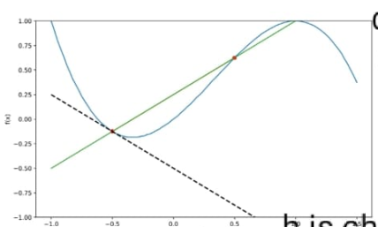

A Quick Guide to Understanding the Basics of Machine Learning

This was created using multiple blogs, my own understanding, and of course ChatGPT. If you find any mistakes, please feel free to reach out.

### What is a derivative?

A derivative of a function represents the rate at which a function's value changes as its input changes. In simpler terms, the derivative measures how a function's output changes in response to changes in its input.

Let’s look at the formula

$f'(x) = \frac{df}{dx} = lim_{h \rightarrow 0} \frac{f(x+h) - f(x)}{h}$

Now remember the formula of slope $= \frac{y_2 - y_1}{x_2 - x_1}$

h is the change in x, so basically the formula give you this slope of the secant line where $y_1$ = f(x) and $y_2$ =  f(x + h).

Now once you have the slope of this line you can decide how much length you want to travel on this down this line. This ‘how much’ is basically learning rate.

  

### What are the rules of differentiation?

1. Sum rule
$\frac{d}{dx}(f(x) + g(x)) = \frac{df}{dx} + \frac{dg}{dx}$
2. Product rule
$\frac{d}{dx}(f(x).g(x)) = \frac{df}{dx}.g(x) + \frac{dg}{dx}.f(x)$ 
3. Chain rule
$\frac{d}{dx}(g \circ f)(x) = \frac{d}{dx}(g(f(x)) = \frac{dg}{dx} \frac{df}{dx}$

### Linear Algebra

https://medium.com/infinity-aka-aseem/summarizing-the-essence-of-linear-algebra-336d38add643

**Vector**

In Machine learning we assume all vectors are rooted at the origin

**Span**

The span of two vectors v and w is the set of all their linear combinations i.e. av + bw.

**Matrix and linear transformation**

matrix vector multiplication is a simple way of telling what transformation a matrix does to a vector.

**Determinant**

The factor by which the area of the basis vector is changed is called the determinant. This is because transformations tend to squish or stretch space

**column space**

**null space**

**Rank**

**non-square matrix**

**Inverse matrix**

**Column space**

**Null space**

**eigenvector and eigenvalue**
    
    For a transformation or a Matrix M there can be vector/vectors which only scale but do not change their direction (do not transform) these vectors are eigenvectors and the value by which they get scaled is called eigenvalue.

#### That’s it, this math is enough to get you started for now you can skip linear algebra for now

### Types of losses

**Loss Types**

**MSE / L2**

**MAE / L1**

**RMSE**

**Huber loss = MAE + MSE**  

Robust to outliers
$Huber = \frac{1}{n}\sum_{i=1}^n(y_i - \hat{y_i})^2$                                    where  $y_i - \hat{y_i} \le \delta$
$Huber = \frac{1}{n}\sum_{i=1}^{n}\delta (|y_i -\hat{y_i}|-\frac{1}{2}\delta)$                 where $y_i - \hat{y_i} > \delta$
$\delta$ is the threshold hyperparameter parameter → you can set them manually
    
**Binary Cross-Entropy Loss / Log Loss**

only for dual classes
$L(y,\hat{y}) = -\frac{1}{N}\sum_{i=1}^{N}[y_i(log(\hat{y_i})+(1-y_i)log(1-\hat{y_i})]$
    
**Categorical Cross-Entropy Loss**

Categorical cross entropy is a loss function used in classification problems where each input belongs to one of multiple classes → softmax
$L = -\frac{1}{m} \sum_{i=1}^{m}y_ilog(\hat{y_i})$
- m is the number of classes
- $y_i$ is the true label (one-hot encoded).
- $\hat{y_i}$ the predicted probability for example i.

example:
Suppose y = [0, 1, 0] is the actual value for three classes (A, B, C) and it belongs to class B which is represented in one hot encoded form
and model predicts $\hat{y}$ = [0.2, 0.7, 0.1]
L = - ( 0.Log(0.2) + 1.log(0.7) + 0.Log(0.1)            → yani ki jiska jitna jyada probability value x utna less log(x) value
L = -Log(0.7)
L = 0.357
    
**Sparse categorical cross entropy**

Sparse categorical cross entropy is similar to categorical cross entropy but is used when the true labels are provided as **integers** instead of one-hot encoded vectors.
$L = -log(\hat{y_c})$
$\hat{y_c}$ is the predicted probability for true class c
example:
y = 1 the true label is given as an integer
and model predicts $\hat{y}$ = [0.2, 0.7, 0.1]
L = -Log($\hat{y_1}$)        here is the real value of y = 0 then we would have took log of $y_0$ 
L = -log(0.7)
L = 0.357
Cross Entropy Loss takes the target labels as One Hot Encoded Vectors, and this may not be feasible if you have many target classes, it is more efficient to represent the target labels as integers rather than one-hot encoded vectors and hence this is where Sparse Cross Entropy should be used. Another caveat — Sparse Cross Entropy should be used when your classes are mutually exclusive, that is, when one sample belongs to only one class, while Cross Entropy should be used when one sample can have multiple classes or labels are soft probabilities like [0.3, 0.7, 0.1].

**Focal Loss**

For large class imbalance
Focal Loss focuses on hard-to-classify examples by down-weighting the loss assigned to well classified examples
$FL(p_t) = -\alpha_t(1 - p_t)^{\gamma}log(p_t)$
$p_t$ is the model’s estimated probability for true classes.
$\alpha_t$ is a balancing factor to address class imbalance.
$\gamma$ is a focusing parameter that adjusts the rate at which easy examples are down weighted