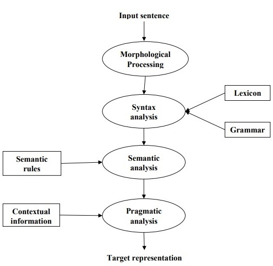

Steps in Natural language processing

Morphological Processing

It is the first phase of NLP. The purpose of this phase is to break chunks of language input into sets of tokens corresponding to paragraphs, sentences and words. For example, a word like “uneasy” can be broken into two sub-word tokens as “un-easy”.

Syntax Analysis

It is the second phase of NLP. The purpose of this phase is two folds: to check that a sentence is well formed or not and to break it up into a structure that shows the syntactic relationships between the different words. For example, the sentence like “The school goes to the boy” would be rejected by syntax analyzer or parser.

Semantic Analysis

It is the third phase of NLP. The purpose of this phase is to draw exact meaning, or you can say dictionary meaning from the text. The text is checked for meaningfulness. For example, semantic analyzer would reject a sentence like “Hot ice-cream”.

Pragmatic Analysis

It is the fourth phase of NLP. Pragmatic analysis simply fits the actual objects/events, which exist in a given context with object references obtained during the last phase (semantic analysis). For example, the sentence “Put the banana in the basket on the shelf” can have two semantic interpretations and pragmatic analyzer will choose between these two possibilities.