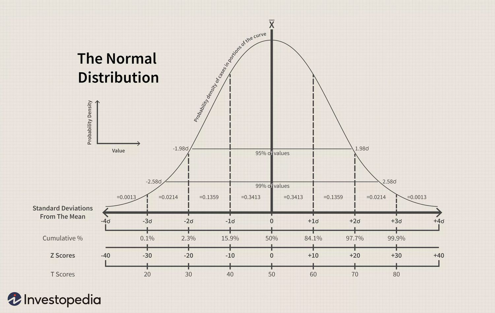
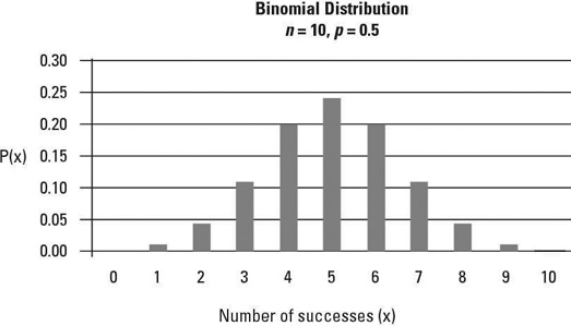
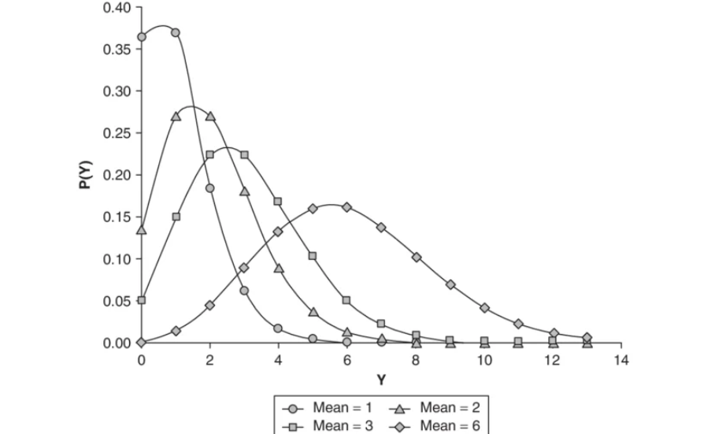

# Data analysis, probability and statistics

## Bias and Variance

The bias-variance tradeoff is a fundamental concept in machine learning that describes the balance between two sources of error: bias and variance.

**Definitions:**
1. **Bias:** Error introduced due to overly simplistic assumptions in the learning algorithm (error on training data).
2. **Variance:** Error introduced due to sensitivity to fluctuations in the training dataset (error when training data changes).

If a model is too simple for the training data, it leads to **underfitting**, which corresponds to **high bias**. In this case, the model fails to capture the underlying patterns in the data. Evaluating such a model on test data is not particularly meaningful, as it performs poorly even on the training set. The variance in this case may be either high or low, but this is largely irrelevant because the model itself is inadequate.

On the other hand, if a model is too complex, it leads to **overfitting**, which corresponds to **low bias**. Here, the model fits the training data very closely, including noise. As a result, when evaluated on new or unseen data, the model exhibits **high variance**, since its predictions are highly sensitive to changes in the training dataset.

The goal is to find a balance between bias and variance, selecting a model that is complex enough to capture the underlying structure of the data, but not so complex that it overfits.

**For High Variance (Low Bias / Overfitting) → Reduce variance**

1. Use bagging (Random Forest)
2. Apply regularization (L1/L2)
3. Reduce model complexity (simpler model, pruning)
4. Increase training data
5. Use dropout (in neural networks)

**For High Bias (Low Variance / Underfitting) → Reduce bias**

1. Use a more complex model
2. Add more features / better feature engineering
3. Reduce regularization
4. Increase model capacity (deeper networks, more trees)
5. Use boosting methods (like Gradient Boosting)

---

## Descriptive Statistics

For the following formulas, let $X$ and $Y$ be datasets with $n$ observations, where $x_i$ and $y_i$ represent individual data points, and $\bar{x}$ and $\bar{y}$ represent their respective means.

---

### Mean

The arithmetic average of a dataset, representing the central value.

$$ 
\bar{x} = \frac{1}{n} \sum_{i=1}^{n} x_i
$$

---

### Mode

The value that appears most frequently in a dataset. A dataset can have one mode, multiple modes (multimodal), or no mode if all values are unique.

$$ 
\text{Mode} = \text{Value with highest frequency} 
$$

---

### Median

The middle value of a dataset when it is ordered from least to greatest. If $n$ is even, it is the average of the two middle values.

$$ 
\text{Median} = \begin{cases} x_{(n+1)/2} & \text{if } n \text{ is odd} \\ \frac{x_{n/2} + x_{n/2 + 1}}{2} & \text{if } n \text{ is even} \end{cases} 
$$

---

### Variance

Measures the spread of data points around the mean. It is the average of the squared deviations from the mean.
$$ 
\sigma^2 = \frac{\sum_{i=1}^{n} (x_i - \bar{x})^2}{n}
$$

---

### Covariance

Indicates the direction of the linear relationship between two variables. A positive covariance means variables move together; a negative covariance means they move in opposite directions.
$$ 
\text{Cov}(X, Y) = \frac{\sum_{i=1}^{n} (x_i - \bar{x})(y_i - \bar{y})}{n}
$$

---

### Standard Deviation

The square root of the variance. It expresses the spread in the same units as the original data, making it more interpretable.

$$ 
\sigma = \sqrt{\frac{\sum_{i=1}^{n} (x_i - \bar{x})^2}{n}} 
$$

---

### Skewness

Measures the asymmetry of the probability distribution. Positive skew indicates a tail on the right; negative skew indicates a tail on the left.

$$ 
\text{Skewness} = \frac{\sum_{i=1}^{n} (x_i - \bar{x})^3 / n}{s^3} 
$$

where $s$ is the sample standard deviation.

---

### Kurtosis

Measures the "tailedness" of the distribution. High kurtosis indicates frequent outliers (heavy tails), while low kurtosis indicates fewer outliers (light tails).

$$ 
\text{Kurtosis} = \frac{\sum_{i=1}^{n} (x_i - \bar{x})^4 / n}{s^4} 
$$

---

### Correlation

The normalized version of covariance (Pearson Correlation Coefficient), ranging from -1 to 1. It measures both the strength and direction of a linear relationship.

$$ 
\rho_{X,Y} = \frac{\text{Cov}(X, Y)}{\sigma_X \sigma_Y} 
$$

---

### Interquartile Range (IQR)

The range between the first quartile ($Q_1$, 25th percentile) and the third quartile ($Q_3$, 75th percentile). It measures the spread of the middle 50\% of the data and is robust to outliers.

$$ 
\text{IQR} = Q_3 - Q_1 
$$

---

### Range

The simplest measure of spread, representing the difference between the maximum and minimum values in the dataset.

$$ 
\text{Range} = X_{max} - X_{min} 
$$

---

### Bayes theorem

Bayes' Theorem is a fundamental rule for updating our beliefs based on new data. It is given by:

$$
P(\theta \mid D) = \frac{P(D \mid \theta)\, P(\theta)}{P(D)}
$$

**Where:**

1. $P(\theta)$ is the **prior}: belief about $\theta$ before seeing data
2. $P(D \mid \theta)$ is the **likelihood}: how likely the data is given $\theta$
3. $P(D)$ is the **evidence}: normalizing constant
4. $P(\theta \mid D)$ is the **posterior}: updated belief after seeing data

**In words:**

$$
\text{Posterior} = \frac{\text{Likelihood} \times \text{Prior}}{\text{Evidence}}
$$

Often, we use the proportional form:
$$
P(\theta \mid D) \propto P(D \mid \theta)\, P(\theta)
$$

**Example: Die Roll**

Suppose we want to determine whether a die is fair or loaded.

1. $\theta_1$: Die is **fair**
2. $\theta_2$: Die is **loaded** (biased towards 6)

**Step 1: Prior**

Before observing any data, assume:

$$
P(\text{fair}) = 0.5, \quad P(\text{loaded}) = 0.5
$$

**Step 2: Data**

We roll the die once and observe:

$$
D = \text{``6''}
$$

**Step 3: Likelihood**

1. If the die is fair:

$$
P(6 \mid \text{fair}) = \frac{1}{6}
$$

2. If the die is loaded (favoring 6):

$$
P(6 \mid \text{loaded}) = \frac{1}{2}
$$

**Step 4: Compute Posterior**

Compute numerator terms:
$$
P(6 \mid \text{fair}) \cdot P(\text{fair}) = \frac{1}{6} \times 0.5 = 0.0833
$$

$$
P(6 \mid \text{loaded}) \cdot P(\text{loaded}) = \frac{1}{2} \times 0.5 = 0.25
$$

Normalize:
$$
P(6) = 0.0833 + 0.25 = 0.3333
$$

Final posterior probabilities:

$$
P(\text{fair} \mid 6) = \frac{0.0833}{0.3333} \approx 0.25
$$

$$
P(\text{loaded} \mid 6) = \frac{0.25}{0.3333} \approx 0.75
$$

**Interpretation:**

After observing a single roll of 6:

1. Probability die is fair $\approx 25\%$
2. Probability die is loaded $\approx 75\%$

The belief shifts toward the die being loaded because rolling a 6 is more likely under that assumption.

Next we keep repeating this by changing our new posterior to our old prior.

---

## Similarity and distance

For the following metrics, assume we have two vectors $\mathbf{A}$ and $\mathbf{B}$ in an $n$-dimensional space:

$$ 
\mathbf{A} = [a_1, a_2, \dots, a_n], \quad \mathbf{B} = [b_1, b_2, \dots, b_n] 
$$

---

### Cosine Similarity

Measures the cosine of the angle between two vectors. It is the normalized inner product and is primarily used in NLP because it is invariant to the magnitude (length) of the vectors.

$$ 
\text{Similarity} = \cos(\theta) = \frac{\mathbf{A} \cdot \mathbf{B}}{\|\mathbf{A}\| \|\mathbf{B}\|} = \frac{\sum_{i=1}^{n} a_i b_i}{\sqrt{\sum_{i=1}^{n} a_i^2} \sqrt{\sum_{i=1}^{n} b_i^2}} 
$$

---

### Dot Product (Inner Product)

Measures the directional alignment and the combined magnitude of two vectors. Unlike Cosine Similarity, it rewards vectors that are both aligned and have high intensity or frequency.

$$ 
\mathbf{A} \cdot \mathbf{B} = \sum_{i=1}^{n} a_i b_i 
$$

---

### Hadamard Product (Element-wise Product)

Performs element-wise multiplication between two vectors of the same dimension. Unlike the Dot Product, it does not aggregate the results into a single value, but instead preserves the individual feature-wise interactions.

$$ 
\mathbf{A} \odot \mathbf{B} = [a_1 b_1,\; a_2 b_2,\; \dots,\; a_n b_n] 
$$

---

### Euclidean Distance ($L_2$ Norm)

Calculates the "straight-line" distance between the tips of two vectors in an $n$-dimensional space. It is highly sensitive to the magnitude of the values.

$$ 
d(\mathbf{A}, \mathbf{B}) = \sqrt{\sum_{i=1}^{n} (a_i - b_i)^2} 
$$

---

### Manhattan Distance ($L_1$ Norm)

Also known as "Taxicab distance," it measures the distance between two points by summing the absolute differences of their coordinates. It is often more robust to outliers than Euclidean distance.

$$ 
d(\mathbf{A}, \mathbf{B}) = \sum_{i=1}^{n} |a_i - b_i| 
$$

---

### Jaccard Similarity

A set-based metric used to compare the similarity and diversity of sample sets. It is defined as the size of the intersection divided by the size of the union of the sample sets.

$$ 
J(A, B) = \frac{|\mathbf{A} \cap \mathbf{B}|}{|\mathbf{A} \cup \mathbf{B}|} 
$$

---

### Mahalanobis Distance

A statistical distance that measures how many standard deviations away a point is from the mean of a distribution. It accounts for the correlation between different variables.

$$ 
d(\mathbf{A}, \mathbf{B}) = \sqrt{(\mathbf{A} - \mathbf{B})^T S^{-1} (\mathbf{A} - \mathbf{B})} 
$$

where $S^{-1}$ is the inverse of the covariance matrix.

---

## Probability Distributions

### Probability Mass Function (PMF)

A Probability Mass Function (PMF) is used for discrete random variables. It gives the probability that a random variable takes an exact value.

In simpler terms, it answers questions like:
\textit{“What is the probability that $X = k$?”}

$$
P(X = k)
$$

For example, in a binomial or Poisson distribution, the random variable can only take specific countable values such as $0, 1, 2, 3, \dots$

Key Properties
1. Defined only for discrete values.
2. Gives probability at an exact point.
3. All probabilities lie between 0 and 1:

$$
0 \leq P(X = k) \leq 1
$$

4. Total probability sums to 1:

$$
\sum_{k} P(X = k) = 1
$$

So, PMF directly assigns probability to each possible outcome.

$$
\text{PMF} \rightarrow \text{probability at a point}
$$

So as PMF is used for discrete data it is natural that when you have a classification model that outputs either 0 or 1 or multiclass classification we are modeling $P(Y | k = X)$ which is a discrete PMF. Examples include Logistic regression, Naive Bayes, Count models etc.

---

### Probability Density Function (PDF)

A Probability Density Function (PDF) is used for continuous random variables. Instead of giving probability at a point, it describes how probability is distributed over a range of values.

In continuous distributions (like Normal distribution), the probability of taking any exact value is zero:

$$
P(X = x) = 0
$$

This is because there are infinitely many possible values.

So instead, we compute probability over an interval:

$$
P(a \leq X \leq b) = \int_a^b f(x)\,dx
$$

Here, the integral represents a continuous summation of infinitely small contributions.

Each small contribution is:

$$
\text{small probability} \approx f(x)\cdot dx
$$

Key Properties

1. Defined for continuous variables.
2. $f(x)$ is not a probability, but a density.
3. Probability is obtained by integrating over a range.
4. Total area under the curve is 1:

$$
\int_{-\infty}^{\infty} f(x)\,dx = 1
$$

Geometrically, the PDF represents the area under the curve between two points.

$$
dx \rightarrow \text{very small width (infinitesimal change in } x\text{)}
$$

$$
\text{PDF} \rightarrow \text{probability over an interval (area under curve)}
$$

So as PDF is used for continuous data it is natural that when you have a regression model that outputs values between a range we are modeling $f(x∣θ)$. $Y \mathcal{N(\mu, \sigma^2)}$ for a gaussian PDF. Examples include Linear regression, Anomaly detection, Generative models etc.

---

### Normal (Gaussian) Distribution

It describes how data is distributed around a central value. Think of things like heights of people, exam scores, measurement errors etc. Most values cluster around an average, and fewer values appear as you move away from it. This creates the famous bell-shaped curve.

     
    <em>Normal Distribution</em>

Key Properties

1. Symmetry: The curve is perfectly symmetric around the center.
2. Mean = Median = Mode: All measures of central tendency are the same.
3. Controlled by Two Parameters: 

$$
\mu \rightarrow \text{mean} \rightarrow \text{center of the distribution}
$$

$$
\delta \rightarrow \text{standard deviation} \rightarrow \text{spread of the data}
$$

**Mathematical Formula**

The probability density function (PDF):

$$
f(x) = \frac{1}{\sigma \sqrt{2\pi}}e^{-\frac{(x - \mu)^2}{2\sigma^2}}
$$

This tells you how likely a value is.

**Standard Normal Distribution**

If we convert any normal distribution into:

we get the standard normal distribution:

$$
\text{Mean} = 0
$$

$$\text{Standard Deviation} = 1$$

This is useful as many machine learning models normality and so it helps in outlier detection and is used in hypothesis testing.

---

### Binomial Distribution

It describes the number of successes in a fixed number of independent trials. Each trial has only two possible outcomes: success or failure. Think of things like coin tosses, pass/fail experiments, or yes/no decisions.

For example, if you toss a coin 10 times, the binomial distribution tells you the probability of getting a certain number of heads.

   
   <em>Binomial Distribution</em>

Key Properties
1. Fixed Number of Trials: The number of experiments $n$ is fixed.
2. Two Outcomes: Each trial results in success or failure.
3. Constant Probability: Probability of success $p$ remains the same.
4. Independence: Each trial is independent of others.

**Mathematical Formula**

The probability mass function (PMF):

$$
P(X = k) = \binom{n}{k} p^k (1 - p)^{n-k}
$$

where:

$$
n \rightarrow \text{number of trials}
$$

$$
k \rightarrow \text{number of successes}
$$

$$p \rightarrow \text{probability of success}
$$

**Mean and Variance**

$$
\text{Mean} = np
$$

$$
\text{Variance} = np(1 - p)
$$

This distribution is discrete and is commonly used in scenarios involving repeated independent experiments.

---

### Poisson Distribution

It describes the number of events occurring in a fixed interval of time or space, given that these events happen at a constant average rate and independently of each other. It is commonly used for modeling rare events.

Think of things like number of emails received per hour, number of customers arriving at a store, or number of defects in a product.

   
   <em>Poisson Distribution</em>

Key Properties
1. Events occur independently.
2. The average rate ($\lambda$) is constant.
3. Two events cannot occur at exactly the same instant.

**Mathematical Formula**

The probability mass function (PMF):

$$
P(X = k) = \frac{e^{-\lambda} \lambda^k}{k!}
$$

where:
$$\lambda \rightarrow \text{average number of events in an interval}$$
$$k \rightarrow \text{number of events}$$

**Mean and Variance**

$$\text{Mean} = \lambda$$
$$\text{Variance} = \lambda$$

This distribution is discrete and is especially useful for modeling the number of occurrences of rare events over a fixed interval.

---

## Central Limit Theorem (CLT)

The Central Limit Theorem (CLT) states that if we take repeated samples from any distribution and compute their averages, the distribution of those sample means will approach a normal distribution, regardless of the original distribution.

In simpler terms, even if the underlying data is skewed or irregular, the average of sufficiently large samples will behave like a normal distribution.

**Formal Statement**

Let a random variable $X$ have:
$$
\text{Mean} = \mu, \quad \text{Variance} = \sigma^2
$$

Then the sample mean $\bar{X}$ of $n$ independent observations is approximately normally distributed:

$$
\bar{X} \sim \mathcal{N}\left(\mu, \frac{\sigma^2}{n}\right)
$$

**Key Properties**

1. Works for any distribution (uniform, skewed, etc.).
2. Requires sufficiently large sample size (typically $n \geq 30$).
3. The mean of the sample means is $\mu$.
4. The variance of the sample means is $\frac{\sigma^2}{n}$.

**Intuition**

The process of averaging reduces randomness:

1. Extreme values tend to cancel out.
2. Variability decreases as sample size increases.
3. The resulting distribution becomes smoother and symmetric.

**Example**

Consider rolling a fair die:

1. A single roll follows a uniform distribution.
2. If we take the average of multiple rolls and repeat this process many times,
the distribution of these averages will resemble a normal distribution.

**Important Note**

CLT applies to the distribution of sample means, not the original data:

1. Original data can follow any distribution.
2. Sample means tend toward a normal distribution.

---

## Hypothesis testing

Hypothesis testing is a statistical framework used to make decisions from data under uncertainty.

The process involves:
1. Starting with a claim (null hypothesis)
1. Using data to evaluate whether this claim is likely to be true

**Key Terms**

1. Null Hypothesis ($H_0$): Default assumption (no effect or no difference)
2. Alternative Hypothesis ($H_1$): What we aim to prove (there is an effect or difference)
3. p-value: Probability of observing the data (or something more extreme) assuming $H_0$ is true
4. Significance Level ($\alpha$): Threshold for decision making (commonly $0.05$)

**Decision Rule**

$$
\text{If } p \leq \alpha \Rightarrow \text{Reject } H_0
$$

$$
\text{If } p > \alpha \Rightarrow \text{Fail to reject } H_0
$$

---

### T-test

The T-test is a statistical hypothesis test used to determine whether there is a significant difference between means when the population standard deviation is unknown. It is based on the Student's T-distribution, which is similar to the normal distribution but has heavier tails to account for additional uncertainty in small samples.

**When to Use a T-Test**

A T-test is appropriate under the following conditions:

1. Unknown Population Variance: The population standard deviation $\sigma$ is not known, so we use the sample standard deviation $s$.
2. Small Sample Size: Typically $n < 30$, although it is also used for larger samples when $\sigma$ is unknown.
3. Approximately Normal Data: The data should be approximately normally distributed (especially important for small samples).
4. Independent Observations: Data points should be independent.

    
**Mathematical Formula**

The T-test computes a t-score:

$$
t = \frac{\bar{X} - \mu}{s / \sqrt{n}}
$$

where:
$$
\bar{X} \rightarrow \text{sample mean}
$$
$$
\mu \rightarrow \text{population mean}
$$
$$
s \rightarrow \text{sample standard deviation}
$$
$$
n \rightarrow \text{sample size}
$$

$$
\frac{s}{\sqrt{n}} \rightarrow \text{standard error}
$$

**Key Idea***

Unlike the Z-test, the T-test accounts for extra uncertainty by using the sample standard deviation. This results in a distribution with heavier tails, especially for small sample sizes.

**Types of T-tests**

1. One-Sample T-Test: Compares a sample mean to a known value.
2. Two-Sample T-Test: Compares means of two independent groups.
3. Paired T-Test: Compares means from the same group at different times (e.g., before vs after).

**Degrees of Freedom**

The shape of the T-distribution depends on degrees of freedom (df):

$$
df = n - 1
$$

As $df$ increases, the T-distribution approaches the standard normal distribution.

**Decision Process**

1. State Hypotheses:
$$H_0: \text{No significant difference (e.g., } \mu = \bar{X})$$
$$H_a: \text{Significant difference (e.g., } \mu \neq \bar{X})$$
2. Choose Significance Level:
$$\alpha = 0.05 \; \text{(commonly used)}$$
3. Find Critical Value:
Use T-distribution table based on $df = n - 1$
This is based on T-table.
4. Make Decision:
    1. If $|t_{\text{calculated}}| > t_{\text{critical}}$, reject $H_0$
    2. Alternatively, if $\text{p-value} < \alpha$, reject $H_0$

**Important Intuition**

Because we estimate variability using sample data, there is more uncertainty compared to the Z-test. The T-distribution compensates for this by having heavier tails, making it more conservative.

As the sample size increases:
1. The estimate of variability improves
2. The T-distribution becomes closer to the normal distribution

**Summary**

$$\text{Use T-test when population variance is unknown and data is limited.}$$

---

### Z-test

The Z-test is a statistical hypothesis test used to determine whether there is a significant difference between a sample mean and a population mean, or between two sample means. It is based on the Standard Normal Distribution (Z-distribution), which assumes a bell-shaped curve with mean 0 and standard deviation 1.

**When to Use a Z-Test**

A Z-test is appropriate only when the following assumptions are satisfied:

1. Known Population Variance: The population standard deviation $\sigma$ is known. If it is unknown, a T-test is typically used.
2. Large Sample Size: Generally $n \geq 30$. By the Central Limit Theorem, the sampling distribution of the mean becomes approximately normal.
3. Independent Observations: Data points must be independent of each other.

**Mathematical Formula**

The Z-test computes a Z-score, which measures how many standard deviations the sample mean is away from the population mean:

$$
Z = \frac{\bar{X} - \mu}{\sigma / \sqrt{n}}
$$

where:
$$\bar{X} \rightarrow \text{sample mean}$$
$$\mu \rightarrow \text{population mean}$$
$$\sigma \rightarrow \text{population standard deviation}$$
$$n \rightarrow \text{sample size}$$

$$\frac{\sigma}{\sqrt{n}} \rightarrow \text{standard error}$$

**Types of Z-Tests**

1. One-Sample Z-Test: Compares a sample mean to a known population mean.
2. Two-Sample Z-Test: Compares means of two independent groups.
3. Z-Test for Proportions: Used for categorical data (e.g., comparing proportions or percentages).

**Decision Process**

1. State Hypotheses:
$$H_0: \text{No significant difference (e.g., } \mu = \bar{X})$$
$$H_a: \text{Significant difference (e.g., } \mu \neq \bar{X})$$
2. Choose Significance Level:
$$\alpha = 0.05 \; \text{(commonly used)}$$
3. Find Critical Value:
For a two-tailed test with $\alpha = 0.05$:
$$Z_{\text{critical}} = \pm 1.96$$
This is based on Z-table.
4. Make Decision:
    1. If $|Z_{\text{calculated}}| > Z_{\text{critical}}$, reject $H_0$
    2. Alternatively, if $\text{p-value} < \alpha$, reject $H_0$

**Z-test vs T-test (Rule of Thumb)**

1. Use Z-test if $n > 30$ and population standard deviation $\sigma$ is known.
2. Use T-test if $n < 30$ or $\sigma$ is unknown (use sample standard deviation $s$ instead).

**Important Intuition**

The population can be thought of as the entire dataset ("the whole pot of soup"), while the sample is a small subset ("a spoonful" used for testing).

There is an important distinction between:

1. Population Standard Deviation ($\sigma$): A fixed value describing the entire population. In practice, this is rarely known.
2. Sample Standard Deviation ($s$): An estimate computed from the sample data.

In most real-world scenarios, $\sigma$ is unknown, which is why T-tests are more commonly used than Z-tests.

---

### ANOVA (F-test) (Analysis of Variance)

ANOVA (Analysis of Variance) is a statistical hypothesis test used to determine whether there are significant differences between the means of three or more groups. Instead of comparing means directly, ANOVA compares the variance between groups to the variance within groups.

**When to Use ANOVA**

ANOVA is appropriate under the following conditions:

1. Comparing More Than Two Groups: Used when there are three or more independent groups.
2. Continuous Dependent Variable: The outcome variable should be continuous.
3. Approximately Normal Data: Each group should be approximately normally distributed.
4. Homogeneity of Variance: Variance across groups should be similar.
5. Independent Observations: Data points should be independent.

**Core Idea**

ANOVA analyzes two types of variability:

1. Variance Between Groups: How much group means differ from the overall mean.
2. Variance Within Groups: How much individual observations differ within each group.

**Mathematical Formula**

The test statistic used in ANOVA is the F-statistic:

$$
F = \frac{\text{Variance Between Groups}}{\text{Variance Within Groups}}
$$

More formally:

$$
F = \frac{\text{Mean Square Between (MSB)}}{\text{Mean Square Within (MSW)}}
$$

**Interpretation**

1. Large $F$ value: Indicates that group means are significantly different.
2. Small $F$ value: Suggests that differences between group means are due to random variation.

**Types of ANOVA**

1. One-Way ANOVA: Tests one independent variable across multiple groups.
2. Two-Way ANOVA: Tests two independent variables and their interaction effects.

**Decision Process**

1. State Hypotheses:
$$H_0: \mu_1 = \mu_2 = \cdots = \mu_k \quad (\text{all group means are equal})$$
$$H_a: \text{At least one group mean is different}$$
2. Choose Significance Level:
$$\alpha = 0.05 \; \text{(commonly used)}$$
3. Compute F-statistic and corresponding p-value
4. Make Decision:
    1. If $\text{p-value} < \alpha$, reject $H_0$
    2. Otherwise, fail to reject $H_0$

**Important Note**

ANOVA tells us that at least one group is different, but it does not specify which groups differ. To identify specific differences, post-hoc tests (such as Tukey's test) are required.

**Why Not Multiple T-tests?**

Performing multiple T-tests increases the probability of Type I error (false positives). ANOVA controls this by testing all groups simultaneously.

---

### Errors in Hypothesis Testing

In hypothesis testing, two types of errors can occur:

**Type I Error (False Positive)**

$$
\text{Reject } H_0 \text{ when it is actually true}
$$

1. Controlled by the significance level $\alpha$
2. Example: Concluding a treatment works when it actually does not

**Type II Error (False Negative)**

$$
\text{Fail to reject } H_0 \text{ when it is actually false}
$$

1. Occurs when we miss a real effect
2. Example: Concluding a treatment does not work when it actually does

**Summary**

$$
\text{Type I Error} \rightarrow \text{False Alarm}
$$
$$
\text{Type II Error} \rightarrow \text{Missed Detection}
$$

---

### Confidence Intervals

A confidence interval provides a range of values within which the true population parameter is likely to lie.

For a mean, a common form is:

$$
\bar{X} \pm z \cdot \frac{\sigma}{\sqrt{n}}
$$

or (when $\sigma$ is unknown):

$$
\bar{X} \pm t \cdot \frac{s}{\sqrt{n}}
$$

**Interpretation**

A 95\% confidence interval means that if we repeat the experiment many times, approximately 95\% of the computed intervals will contain the true parameter.

**Connection to Hypothesis Testing**

1. If the null hypothesis value lies outside the confidence interval, we reject $H_0$
2. Otherwise, we fail to reject $H_0$

---

### P-value (Deep Intuition)

The p-value measures how extreme the observed data is under the assumption that the null hypothesis is true.

Formally:

$$
\text{p-value} = P(\text{observing data as extreme or more extreme} \mid H_0)
$$

**Important Clarifications**

1. It is NOT the probability that $H_0$ is true
2. It is NOT the probability that the alternative hypothesis is true

**Interpretation**

1. Small p-value: Data is unlikely under $H_0$ $\rightarrow$ evidence against $H_0$
2. Large p-value: Data is consistent with $H_0$

**Intuition**

The p-value represents the area in the tail(s) of the distribution beyond the observed test statistic.

$$
\text{Smaller p-value} \Rightarrow \text{Stronger evidence against } H_0
$$

---

## A/B Testing

A/B testing is a statistical method used to compare two versions of a system to determine which one performs better. It is widely used in product development, marketing, and machine learning to make data-driven decisions.

In A/B testing:

1. Version A: Control group (existing system)
2. Version B: Treatment group (new variation)

The goal is to check whether the difference in performance between A and B is statistically significant or just due to random variation.

**Example**

1. Version A: Old website design
2. Version B: New website design
3. Metric: Click-through rate (CTR)

We test whether Version B improves CTR compared to Version A.

**Hypothesis Formulation}

$$
H_0: \mu_A = \mu_B \quad (\text{no difference})
$$

$$
H_a: \mu_A \neq \mu_B \quad (\text{significant difference})
$$

**Test Statistic**

Depending on the problem:

1. Continuous metric (e.g., revenue, time spent): use T-test or Z-test
2. Proportions (e.g., CTR, conversion rate): use Z-test for proportions

**Decision Rule**

$$
\text{If p-value} \leq \alpha \Rightarrow \text{Reject } H_0
$$

$$
\text{If p-value} > \alpha \Rightarrow \text{Fail to reject } H_0
$$

**Key Steps in A/B Testing**

1. Define objective and metric (e.g., CTR, conversion rate)
2. Split users randomly into two groups (A and B)
3. Run the experiment for a fixed duration
4. Collect data and compute test statistic
5. Calculate p-value and make decision

**Important Considerations**

1. Randomization: Ensures unbiased comparison
2. Sample Size: Must be large enough for reliable results
3. Duration: Should capture sufficient user behavior
4. Multiple Testing: Avoid running many tests simultaneously without correction

**Practical Insight**

A/B testing is essentially an application of hypothesis testing in real-world systems, where decisions are made based on whether observed differences are statistically significant.

**Summary**

$$
\text{A/B Testing} \rightarrow \text{Compare two variants and decide using statistical significance}
$$

---

## Information Theory

---

### Entropy, Cross-Entropy and conditional entropy

---

### Mutual Information

---

### Jensen--Shannon Divergence

The Jensen--Shannon (JS) divergence is a **symmetric and stable** measure of similarity between two probability distributions. It is defined as:

$$
JS(P \| Q) = \frac{1}{2} KL(P \| M) + \frac{1}{2} KL(Q \| M)
$$

where:

$$
M = \frac{1}{2}(P + Q)
$$

**Interpretation:**
JS divergence measures how far both distributions $P$ and $Q$ are from their **average distribution** $M$.

1. $P$ = true distribution  
2. $Q$ = approximate/model distribution  
3. $M$ = midpoint (mixture of $P$ and $Q$)

**Key Properties:**

1. **Symmetric:**
$$
JS(P \| Q) = JS(Q \| P)
$$
2. **Bounded:**
$$
0 \leq JS(P \| Q) \leq \log 2
$$
3. **Always finite:**  
Unlike KL divergence, JS divergence does not blow up when $Q(i) = 0$.

**Relation to KL Divergence:**

JS divergence is built using KL divergence but fixes its limitations:

1. KL is asymmetric $\Rightarrow$ JS is symmetric
2. KL can be infinite $\Rightarrow$ JS is bounded and stable

**Intuition:**

1. Instead of directly comparing $P$ and $Q$, JS compares each to their average $M$
2. Measures how much **both distributions disagree with their midpoint}

**Alternative entropy form:**

$$
JS(P \| Q) = H(M) - \frac{1}{2}H(P) - \frac{1}{2}H(Q)
$$

**Applications:**

1. Generative Adversarial Networks (GANs)
2. Comparing probability distributions
3. Clustering and similarity measures

**One-line summary:**

$$
\text{JS divergence} = \text{average KL distance from the midpoint distribution}
$$

---

### Maximum Likelihood Estimation (MLE)

---

### Markov Chain

---

### Reparametrization invariance

---

### Kullback–Leibler divergence (information gain)

KL divergence is used to compare two probability distributions over the same random variable X and it tells us how different these two distributions are. It is defined as:

$$
KL(P \| Q) = \sum_i P(i)\, \log \frac{P(i)}{Q(i)}
$$

Here i embedding/representation must be softmaxed meaning they all embeddings of i should sum up to 1.

**Interpretation:**  
KL divergence can be thought of as the **extra surprise** or **extra number of bits** required when we use an approximate distribution $Q$ instead of the true distribution $P$.

1. $P$ = true distribution (what actually happens)
2. $Q$ = approximate/model distribution (what we assume)

**Log term (surprise / mismatch):**

$$
\log \frac{P(i)}{Q(i)}
$$

This measures how surprising an event $i$ is under $Q$ compared to reality $P$:

1. If $P(i) \gg Q(i)$: ratio is large $\Rightarrow$ large positive value  
$\Rightarrow$ **high penalty (Q underestimated an important event)**
2. If $P(i) \approx Q(i)$: ratio $\approx 1$ $\Rightarrow \log \approx 0$  
$\Rightarrow$ **no penalty**
3. If $P(i) \ll Q(i)$: ratio $< 1$ $\Rightarrow$ negative log  
$\Rightarrow$ **small "discount" (Q overestimated a rare event)**

**Weighting by $P(i)$ (importance):**

$$
P(i)\, \log \frac{P(i)}{Q(i)}
$$

The surprise is weighted by how often the event actually occurs:

1. Frequent events (large $P(i)$) contribute more to the loss
2. Rare events (small $P(i)$) contribute very little

**Key idea:** KL divergence focuses on getting **important events right**.

**Summation (total mismatch):**

$$
\sum_i P(i)\, \log \frac{P(i)}{Q(i)}
$$

We sum over all outcomes to compute the total mismatch between $P$ and $Q$.

**Alternative view (optimization perspective):**

$$
KL(P \| Q) = \sum_i P(i)\log P(i) - \sum_i P(i)\log Q(i)
$$

Since the first term is constant (depends only on $P$), minimizing KL divergence is equivalent to:

$$
\max \sum_i P(i)\log Q(i)
$$

**Interpretation:** assign high probability in $Q$ to events that are likely under $P$.

**Intuition:**

1. KL divergence measures how wrong $Q$ is compared to $P$
2. It computes a **weighted average of errors**
3. Errors on important (high-probability) events matter more