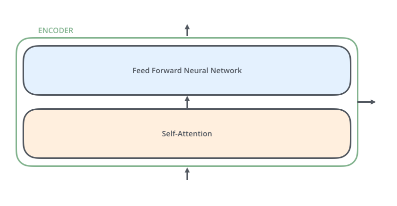
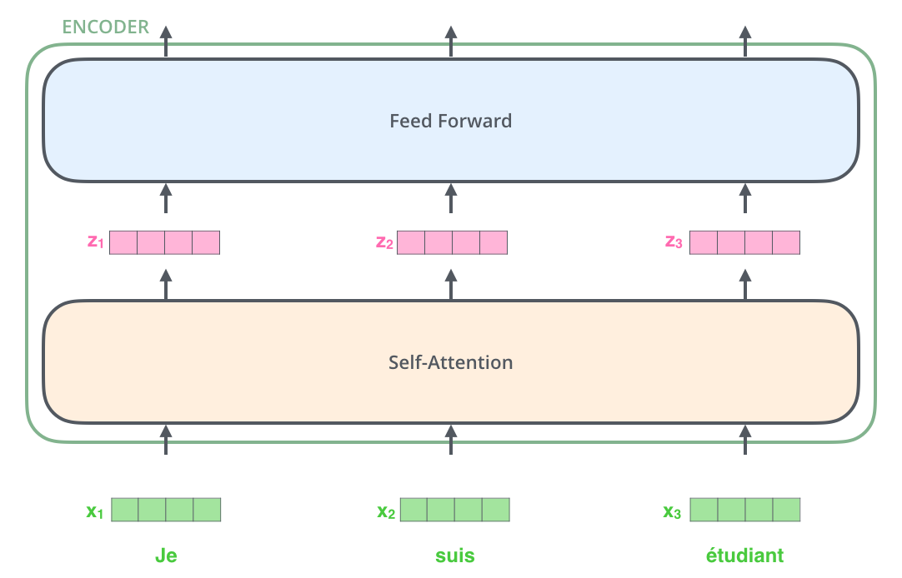
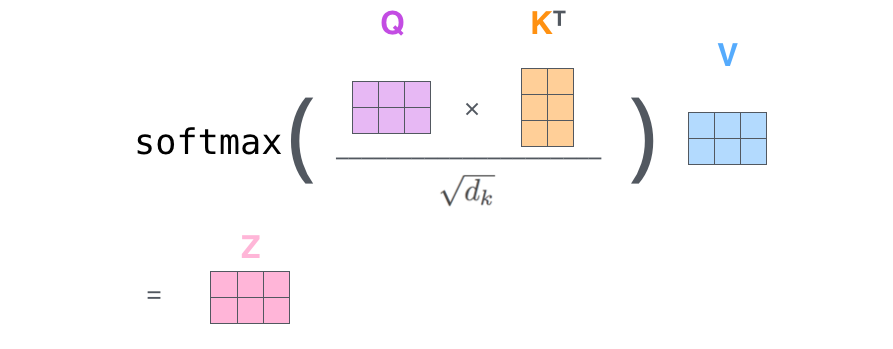

# Transformers

## Working of a transformer

Transformers consists of two parts an encoder and a decoder. The encoding part is a group of multiple encoders and the decoding part is a set of multiple decoders.

---

### Encoder

An encoder consists of a self-attention layer followed by a feed forward neural network layer. 

     
    <em>Encoder</em>

---

### Decoder

The decoder on the other hand has an additional layer that focuses helps it focus on the relavant part of the input sentences.

     
    <em>Decoder</em>

---

### Transformer input

The input to the transformer encoder is a sentence which is a group of words. These words are converted into a embeddings using an embedding algorithm (word2vec, glove, etc). Each word vector embedding is of same size (a hyperparameter eg. 512). Each of these embeddings pass through an encoder. Each embeddings first pass through the self attention block followed by the FFN network

     
    <em>Encoder with tensors</em>

---

### Self attention

     
    <em>Self attention</em>

1. From the encoder's input create three vectors Query, Key and Value ($E_Q$, $E_K$ and $E_V$). This is formed by multiplying the input vector with three matrices that are learned during training ($W^Q$, $W^K$ and $W^V$). 
2. Next we calculate a score. This score needs to be calculated for each word in the input to the (it is a score of attention that each word should give to each other word). It is calculated by taking a dot product of the query vector with the key vector of the respective word that we are scoring.
eg:- The hill station is chilly. Here suppose we are at word station. The we to find score for chilly and station (current word) we need to multiply the query of 'station' to key of 'chilly'.
4. We then divide the score by 8 (basically $\sqrt{d_k}$ here $d_k$ is 512 so 8) To ensure stable gradients. 
4. The result is then passed through a softmax operation (all scores are normalized so that they add to 1). This softmax score determines how much each word will be expressed at this current position. 
5. Now we multiply **each** value vector by the softmax score (this keeps intact the value of words that needs to be attended to at each point). 
6. The sixth step is to sum all the weighted value vectors. This produces the output of the self-attention layer at this position. 

     
    <em>Self attention calculation</em>

Understanding with an example

1. Setup (Example)

    Sentence:

    eg:- there is something under ...

    We focus on computing attention for the word **"under"**.

2. Query, Key, Value

    * Query → from **"under"** → ($ Q_{\text{under}}$ )
    * Keys → from all words → ($ K_{\text{there}}, K_{\text{is}}, K_{\text{something}}, K_{\text{under}} $)
    * Values → from all words → ($ V_{\text{there}}, V_{\text{is}}, V_{\text{something}}, V_{\text{under}} $)

3. Compute Attention Scores

    For each word:

    $$
    \text{score}*i = Q*{\text{under}} \cdot K_i^T
    $$

    Example:
    $$
    Q_{\text{under}} \cdot K_{\text{something}}^T
    $$

    Each score is a **scalar** (relevance)

4. Softmax → Attention Weights

    Compute scores for all words:

    -> there, is, something, under

    Then normalize:

    $$
    \alpha_i = \text{softmax}(\text{scores})
    $$

    Now each word gets a **weight (probability)**

5. Weighted Sum of Values

    $$
    \text{output}_{\text{under}} = \sum_i \alpha_i \cdot V_i
    $$

    Expanded:

    $$
    \alpha_{there} \cdot V_{there} + \alpha_{is} \cdot V_{is} + \alpha_{something} \cdot V_{something} + \alpha_{under} · V_{under}
    $$

    This gives **one vector** (the self-attention vector)

6. Contextual Embedding

    The result is: output_under

    A **context-aware embedding of "under"**

    Contains information from all relevant words

7. Output Projection (Multi-head mixing)

    $$
    \text{attention\_output} = \text{output}_{\text{under}} \cdot W_o
    $$

    Combines information across attention heads

8. Residual Connection + LayerNorm

    $$
    \text{new\_under} = \text{LayerNorm}(\text{original\_under} + \text{attention\_output})
    $$

    * `original_under` = input embedding at this layer
    * Adds stability and preserves original information

9. Feed Forward Network (FFN)

    $$
    \text{ffn\_output} = \text{FFN}(\text{new\_under})
    $$

    Typically:

    * Linear → GELU → Linear

    Further transforms representation

10. Repeat Across Layers

    The above steps repeat across multiple transformer layers

    Final result:

    $$
    h_{\text{under}} \in \mathbb{R}^d
    $$

11. Project to Vocabulary Space

    $$
    \text{logits} = h_{\text{under}} \cdot W_{\text{vocab}}^T
    $$

    Where:

    * ($ W_{\text{vocab}} \in \mathbb{R}^{V \times d} $)
    * (V) = vocab size

12. Output Vector

    $$
    \text{logits} \in \mathbb{R}^{V}
    $$

    One score per token in vocabulary

13. Interpretation

    Each row of ( $W_{\text{vocab}}$ ) is a token embedding:

    $$
    \text{logit}_i = h \cdot e_i
    $$

    Measures **similarity between final embedding and each token**

14. Final Prediction

    $$
    P(\text{token}_i) = \text{softmax}(\text{logits})
    $$

    * Choose highest (greedy) OR
    * Sample from distribution

---

### Matrix calculation of self-attention (every input at once)

The first step is the calculation of Query, Key and Value matrices. We do this by packaging out embeddings into a matrix X, and multiplying it with weight matrices we've trained ($W_Q, W_K, W_V$)

     
    <em>Self attention matrix calculation</em>

Finally, since we’re dealing with matrices, we can condense steps two through six in one formula to calculate the outputs of the self-attention layer (each query row automatically mulitplies with each Key resulting in a matrix of scores followed by mulitplication with each value to give final z embeddings which can be added).

     
    <em>Softmax representation for attention mechanism</em>

In the case of multiple heads we get multiple V matrices at the end. These matrices are concatenated are multiplied by a new matrix $W_O$ which has resulting dimension of original V matrix.

---

### Positional encoding

This bit attends to giving the embedding/word the positional information of itself and its peer words in the sentence. This is calculated using cosine and sine formulas and added to input embeddings.

---

### Residual connections

The input to an encoder is used as a residual connection at the end of self attention block at the start of add and normalize block.

     
    <em>Transformer residual layer normalization</em>

---

### decoder

In decoder the self attention layer is only allowed to attend to earlier positions in the output sequence. This is done by masking the future positions before the softmax step in self-attention calculation. This decoder works similar to encoder only difference would be that it creates its query matrix from the layer below it but takes the keys and values from the output of the encoder stack (this is called encoder-decoder attention or cross attention).

---

## T5

The T5 model (short for Text-to-Text Transfer Transformer) showed that scaling up transformers (hundreds of millions to billions of parameters) and pretraining them on massive data (C4 dataset) gave strong generalization. Instead of BERT’s masked language modeling (masking individual tokens), T5 used span corruption:

1. Random spans of text are replaced with a unique sentinel token (like <extra\_id\_0>).
2. The model learns to generate the missing spans.
3. example:
    1. Input → "The <extra\_id\_0> is on the <extra\_id\_1>."
    2. Output → "<extra\_id\_0> book <extra\_id\_1> table"

It can be used for Summarization, translation, classification, QA, reasoning etc. Chatmodels like chatGPT require long form generation and dialogue memory, however T5 models are less chatty and harder to scale at 100B+ params.

---